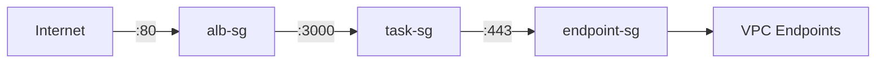
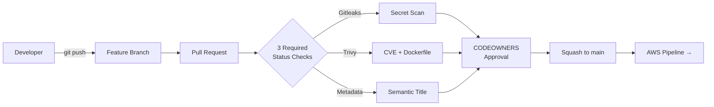
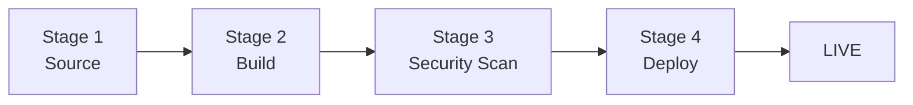
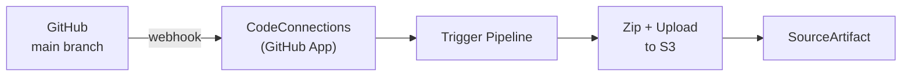
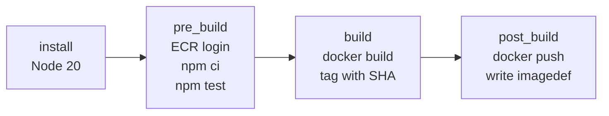
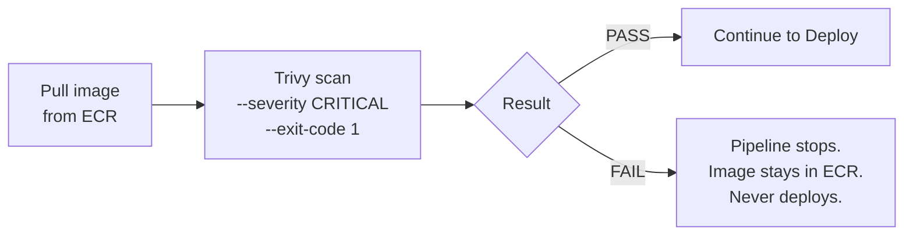
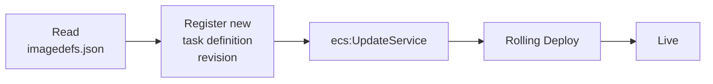
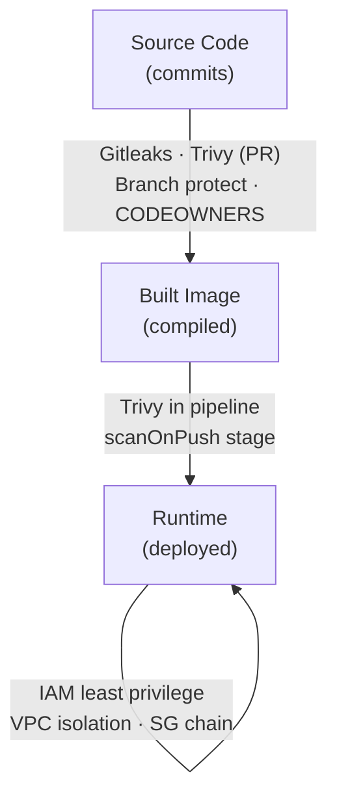
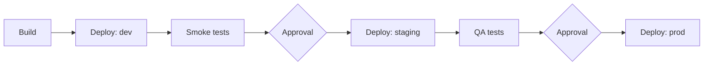

# Getting Started with CI/CD — The AWS Native Way

> A hands-on demo of an AWS-native CI/CD pipeline built end-to-end on production-aligned infrastructure. Single `git push` → six security gates → live container in production, in 3–5 minutes.

[]() []() []()

**Session:** AWS Cloud Captains · University undergraduate group
**Stack:** GitHub → CodeConnections → CodePipeline → CodeBuild → ECR → ECS Fargate
**Region:** ap-southeast-1 (Singapore)

---

## 📦 Repository Contents

| File | What it is |
|---|---|
| [`slide-deck.pdf`](./slide-deck.pdf) | The 15-slide presentation |
| [`infrastructure-diagram.png`](./infrastructure-diagram.png) | AWS infrastructure architecture |
| [`cicd-pipeline-diagram.png`](./cicd-pipeline-diagram.png) | CI/CD pipeline architecture |
| `README.md` | This document |

---

## 🎯 The Demo in One Picture

```
   Developer                                                Live Endpoint
       │                                                          ▲
       │  git push                                                │
       ▼                                                          │
   ┌────────┐    ┌──────────────┐    ┌──────────────┐    ┌────────────┐
   │ GitHub │───▶│ CodeConnect  │───▶│ CodePipeline │───▶│ ECS Fargate│
   └────────┘    └──────────────┘    └──────────────┘    └────────────┘
       │                                     │                    ▲
       ▼                                     ▼                    │
   ┌──────────────────┐               ┌──────────────┐    ┌──────────────┐
   │ PR Security Gate │               │  CodeBuild   │───▶│     ECR      │
   │ • Gitleaks       │               │ • npm test   │    │  Immutable   │
   │ • Trivy          │               │ • docker     │    │   Tags       │
   │ • PR Metadata    │               │ • push       │    │  scanOnPush  │
   │ • CODEOWNERS     │               └──────────────┘    └──────────────┘
   └──────────────────┘                       │
                                              ▼
                                      ┌───────────────┐
                                      │ Trivy Image   │
                                      │ Scan (CRITICAL│
                                      │ blocks deploy)│
                                      └───────────────┘
```

---

## 🚀 Quick Navigation

| If you want to... | Jump to |
|---|---|
| Understand the design philosophy | [Why This Design](#-why-this-design) |
| See the network layout | [Infrastructure Architecture](#-infrastructure-architecture) |
| Trace a `git push` end-to-end | [CI/CD Pipeline Walkthrough](#-cicd-pipeline-walkthrough) |
| See the security controls | [Security Posture](#-security-posture) |
| Know what was left out | [Evolution Path](#-evolution-path) |
| Estimate cost | [Cost Profile](#-cost-profile) |

---

## 💡 Why This Design

Three principles drove every decision.

### Principle 1 — Production-shaped infrastructure, demo-sized cost

The infrastructure was built the way a real production environment would be built. Multi-AZ, private-by-default, IAM-scoped, observable from day one. The only concessions for cost are the number of running tasks (one instead of two-plus) and the absence of multiple environments (single deploy target instead of dev/staging/prod). The architectural patterns are identical to what you would deploy at a company; only the dimensions are smaller.

It would have been faster and cheaper to demo the pipeline using the default VPC with public subnets. That ships bits to a running container. But it would have taught the wrong lesson — that getting CI/CD working is the goal. The real goal is getting CI/CD working *securely, reliably, observably, and cheaply at scale*.

### Principle 2 — Native AWS where it fits, GitHub where it matters

The demo uses AWS-native services for everything inside AWS — CodePipeline, CodeBuild, ECR, ECS, IAM, CloudWatch. But it uses **GitHub for source control**, not AWS CodeCommit. The industry standard is GitHub. The audience already uses it. Forcing CodeCommit for the sake of being "100% native" would have made the demo feel artificial.

The bridge is **AWS CodeConnections** (renamed from CodeStar Connections in March 2024). It is a managed OAuth broker that holds the GitHub App credential. From AWS's perspective, all CodePipeline knows is "there is a connection ARN to a GitHub repo." From GitHub's perspective, all the integration knows is "there is an installed GitHub App with read access to one repo." No long-lived tokens. Per-repo scoping. Revocable in one click.

### Principle 3 — Hardening at every layer, not just the obvious one

Most CI/CD demos focus only on the pipeline and treat the infrastructure as plumbing. This demo hardens both layers and shows the seams.

- **GitHub side** — branch protection, CODEOWNERS-enforced reviews, structured PR template, three required security scans (Gitleaks for secrets, Trivy for vulnerabilities, semantic-PR validation)
- **AWS side** — private-subnet workloads, VPC endpoints in place of NAT, three-layer security group chains, immutable container tags with vulnerability scanning at push, IAM roles per service with no shared credentials, dedicated Trivy image scan stage between build and deploy

Defense in depth is not a slide; it is the actual structure of the system.

---

## 🏗️ Infrastructure Architecture

📷 **Visual:** [`infrastructure-diagram.png`](./infrastructure-diagram.png)

### The Big Picture

```
┌─────────────────────────────────────────────────────────────────┐
│                          AWS Cloud                               │
│  ┌───────────────────────────────────────────────────────────┐  │
│  │                  VPC 10.0.0.0/16                          │  │
│  │                                                           │  │
│  │  ┌─────────────────────┐  ┌─────────────────────┐        │  │
│  │  │     AZ-A (1a)       │  │     AZ-B (1b)       │        │  │
│  │  │  ┌───────────────┐  │  │  ┌───────────────┐  │        │  │
│  │  │  │ Public Subnet │  │  │  │ Public Subnet │  │        │  │
│  │  │  │  10.0.0.0/24  │  │  │  │  10.0.1.0/24  │  │        │  │
│  │  │  │   [ALB ENI]   │◀─┼──┼─▶│   [ALB ENI]   │  │        │  │
│  │  │  └───────┬───────┘  │  │  └───────┬───────┘  │        │  │
│  │  │          │          │  │          │          │        │  │
│  │  │  ┌───────▼───────┐  │  │  ┌───────▼───────┐  │        │  │
│  │  │  │Private Subnet │  │  │  │Private Subnet │  │        │  │
│  │  │  │ 10.0.10.0/24  │  │  │  │ 10.0.11.0/24  │  │        │  │
│  │  │  │ [Fargate Task]│  │  │  │ [Fargate Task]│  │        │  │
│  │  │  │  No public IP │  │  │  │  No public IP │  │        │  │
│  │  │  └───────┬───────┘  │  │  └───────┬───────┘  │        │  │
│  │  └──────────┼──────────┘  └──────────┼──────────┘        │  │
│  │             │                        │                    │  │
│  │  ┌──────────▼────────────────────────▼──────────┐        │  │
│  │  │            VPC Endpoints                     │        │  │
│  │  │  ecr.api │ ecr.dkr │ logs │ s3 (FREE)        │        │  │
│  │  └──────────────────────┬───────────────────────┘        │  │
│  └─────────────────────────┼──────────────────────────────  │  │
│                            │                                 │  │
│  ┌─────────────────────────▼──────────────────────────────┐ │  │
│  │           AWS-Managed Services (over backbone)          │ │  │
│  │              ECR · CloudWatch Logs                      │ │  │
│  └─────────────────────────────────────────────────────────┘ │  │
└────────────────────────────────────────────────────────────────┘
                                ▲
                                │ port 80
                          ┌─────┴─────┐
                          │  Internet │
                          └───────────┘
```

### Why Each Component

### 🌐 VPC + Multi-AZ

A custom VPC instead of the default VPC because real environments need controlled CIDR allocation, routing, and tagging. Two AZs because Fargate requires two and because single-AZ is one hardware failure away from being offline.

> **Pillar:** Reliability

### 🔓 Public Subnets — ALB Only

Public subnets host nothing except the ALB's ENIs. The route table has a default route to the Internet Gateway. In a larger deployment this is also where bastion hosts and NAT Gateways would live, but neither is needed here.

### 🔒 Private Subnets — Fargate Tasks

Fargate tasks run here with **no public IPs assigned**. The route table has no default route to the internet. Even if someone obtained the task's private IP, there is no network path from the public internet to reach it.

> **Pillar:** Security (defense in depth)

### ⚖️ Application Load Balancer + Target Group

The ALB is a managed Layer 7 load balancer. AWS handles scaling, patching, certificate rotation, multi-AZ distribution. No Nginx or HAProxy on EC2 to maintain.

The ALB does not talk to tasks directly — it forwards to a **target group**. The target group has tasks registered (by IP, since Fargate uses `awsvpc` networking). This indirection is what enables zero-downtime rolling deployments: new tasks register, pass health checks, then old tasks deregister.

> **Pillars:** Operational Excellence, Reliability

### 🛡️ Three-Layer Security Group Chain

| From | To | Port | Allowed source |
|---|---|---|---|
| Internet | `alb-sg` | 80 | 0.0.0.0/0 |
| `alb-sg` | `task-sg` | 3000 | `alb-sg` only |
| `task-sg` | `endpoint-sg` | 443 | `task-sg` only |



Each layer trusts only the layer above. The pattern is **identity-based, not IP-based** — when the ALB scales out, the new ENI inherits `alb-sg`, and `task-sg` instantly trusts it. No firewall rule update needed.

> **Pillar:** Security

### 🔐 VPC Endpoints — Instead of NAT Gateway

| Approach | Base cost | Data cost | Path | Failure mode |
|---|---|---|---|---|
| NAT Gateway | ~$32/mo | $0.045/GB | Public internet hop | Single AZ point of failure |
| VPC Endpoints | ~$21/mo | $0.01/GB | AWS backbone end-to-end | Distributed by default |
| S3 Gateway Endpoint | **FREE** | None | Backbone | n/a |

Three Interface endpoints (`ecr.api`, `ecr.dkr`, `logs`) plus one Gateway endpoint (`s3`) replace the NAT Gateway entirely. Endpoints are cheaper, more private, and have no single point of failure. The S3 gateway endpoint is required because ECR stores image layers in S3 behind the scenes.

> **Pillars:** Cost Optimization + Security

### 📦 ECS + Fargate

ECS is the orchestrator (knows about clusters, services, tasks, task definitions). Fargate is the compute layer (provides AWS-managed VMs). The customer specifies CPU and memory; AWS provisions invisibly. Per-second billing with a 1-minute minimum. Scale to zero = zero cost.

> **Pillars:** Operational Excellence, Cost Optimization

### 🐳 ECR — Immutable Tags + scanOnPush

Two non-default settings shape everything:

- **IMMUTABLE tags** — once `task-api:a1b2c3d` is pushed, that tag can never be overwritten. No silent drift. No `:latest` problem. Rollback is "point ECS at an older SHA."
- **scanOnPush** — every image gets a CVE scan at the moment of push.

Combined with Git commit SHA tagging, every running container is traceable to an exact line of code.

> **Pillars:** Security, Reliability

### 👥 IAM — Four Roles, Each With One Job

| Role | Used by | Permissions |
|---|---|---|
| `codeBuildTaskApiRole` | CodeBuild | ECR push, CloudWatch write, S3 artifact R/W. **No ECS, no PassRole.** |
| `codePipelineTaskApiRole` | CodePipeline | CodeBuild invoke, S3 artifact R/W, `ecs:UpdateService`, scoped `iam:PassRole` |
| `ecsTaskExecutionRole` | AWS (pre-startup) | ECR pull, CloudWatch log create. Used **before** the container starts. |
| `taskApiTaskRole` | Application runtime | Empty. App calls no AWS APIs in this demo. |

**Why two ECS roles?** This trips everyone up the first time.

- **Execution role** = "AWS, please pull the image and create the log stream **before** the container starts."
- **Task role** = "These are the AWS credentials the **running app** will use."

A misconfigured execution role doesn't hand the app extra power. A misconfigured task role does. Keeping them separate keeps the blast radius small.

> **Pillar:** Security — least privilege, no shared credentials.

---

## ⚙️ CI/CD Pipeline Walkthrough

📷 **Visual:** [`cicd-pipeline-diagram.png`](./cicd-pipeline-diagram.png)

### The Two-Phase Flow





**Two-phase rule:** AWS resources are not touched until every GitHub gate passes. The pipeline only runs on `main`, and `main` can only be reached through a reviewed, scanned, approved PR.

---

### Phase 1 — GitHub Validation

#### 🔒 Branch Protection on `main`

Direct pushes are rejected by GitHub itself, regardless of user permissions. Every change requires:

- A Pull Request (no direct push)
- At least one approving review from a code owner
- All required status checks passing
- Branch up-to-date with main
- All review conversations resolved

> **Live demo moment:** `git push origin main` directly fails with `Protected branch update failed`. There is no backdoor, even for admins.

#### 👤 CODEOWNERS

Maps file paths to required reviewers. Touching the buildspec, Dockerfile, or workflow file pulls in a designated owner. In a real team, this is what scales code review without becoming a bottleneck.

```text
# .github/CODEOWNERS
*                       @Nikila99gimhan
Dockerfile              @Nikila99gimhan
buildspec.yml           @Nikila99gimhan
.github/workflows/      @Nikila99gimhan
```

#### 📝 PR Template

`.github/pull_request_template.md` auto-populates every new PR with a structured checklist (type, summary, testing, security, deployment impact). Not for compliance theater — structured PR descriptions become structured commit messages, which become the basis for changelog automation and semantic versioning.

#### 🔍 Trivy Scan at PR Time

Two parts:

| Scan | What it looks at | Failure threshold |
|---|---|---|
| Filesystem | npm dependencies | HIGH + CRITICAL |
| Dockerfile | misconfigurations (root user, missing USER, exposed secrets) | HIGH + CRITICAL |

Results posted as a comment **on the PR** that updates in place across pushes. The PR comment is what makes this stick — a scanner that fails silently with a red X gets ignored; one that posts the actual findings gets read.

#### 🕵️ Gitleaks at PR Time

Scans the entire commit history of the PR branch for accidentally committed secrets — AWS keys, GitHub tokens, database connection strings, private keys. Custom `.gitleaks.toml` extends defaults with project-specific rules and allowlists.

---

### Phase 2 — AWS CodePipeline

#### Stage 1 → Source



CodeConnections is the modern bridge to GitHub. Renamed from CodeStar Connections in March 2024. Behind the scenes it's a managed OAuth broker holding the GitHub App credential. **No long-lived PATs anywhere in AWS.**

---

#### Stage 2 → Build (CodeBuild — `task-api-build`)



**Tests run in `pre_build`, not `build`** — deliberately. A failing test aborts before any image is built. Broken code never produces a container, never reaches the registry, never threatens production. **Fail fast.**

---

#### 🔑 The Critical Handoff — `imagedefinitions.json`

This is the most important artifact in the entire pipeline.

```json
[{"name":"task-api","imageUri":"320026168830.dkr.ecr.ap-southeast-1.amazonaws.com/task-api:a1b2c3d"}]
```

The contract between Build and Deploy:

| Field | Rule | Failure mode |
|---|---|---|
| `name` | Must exactly match `containerDefinitions[].name` in the ECS task definition | "container not found in task definition" |
| `imageUri` | Must point to a valid image actually pushed to ECR | `CannotPullContainerError` |

**The file is where 80% of CodePipeline-to-ECS debugging happens.** Understanding it is what separates someone who knows the pipeline from someone who can fix it.

---

#### Stage 3 → Security Scan (CodeBuild — `task-api-security-scan`)



**Why scan twice — once at PR, once here?** They scan different things:

| Scan layer | What it sees |
|---|---|
| **PR-time** | Source code, Dockerfile, declared dependencies |
| **Build-time (this stage)** | Actual built image — base image OS packages, transitive dependencies that only manifest after `npm ci` |

Together they cover much more surface than either alone. CVE databases also update between PR-time and build-time, so a vulnerability that didn't exist at PR time can be caught here.

---

#### Stage 4 → Deploy (ECS native action)



**ECS rolling deployment behavior:**

- `maximumPercent: 200` — can run up to 2× desired tasks during deploy
- `minimumHealthyPercent: 100` — never drop below desired count
- **Translation:** start new task FIRST, wait for ALB health check, THEN drain old task

**Deployment Circuit Breaker** (with `rollback: true`) is the strongest single operational safety feature in the stack. If new tasks fail to stabilize repeatedly, ECS automatically reverts to the last known good task definition. Automatic. No human intervention. No paging. The service self-heals.

**End-to-end time:** 3–5 minutes from `git push` to live.

---

### Why CodeBuild and CodePipeline Specifically

#### CodeBuild — managed, ephemeral, single-purpose

One responsibility: take source, run a buildspec, produce an artifact. Each build runs in a freshly-provisioned container, destroyed at the end.

| Property | CodeBuild | Self-hosted Jenkins |
|---|---|---|
| Patching | AWS handles it | You handle it |
| Scaling for parallel builds | Automatic | Manual capacity sizing |
| Idle cost | Zero | 24/7 EC2 cost |
| State between builds | None (clean container) | Risk of accumulated cruft |
| Cost (small project) | ~$1/day for 100 builds | ~$30/mo for one `m5.xlarge` |

`BUILD_GENERAL1_SMALL` (3 GB RAM, 2 vCPU) costs ~$0.005/min. A 2-minute build = ~1¢. Zero idle cost between builds.

#### CodePipeline — pure orchestrator, never executes work

The mental model: a sequence of stages connected by named artifacts. Each stage invokes one or more action providers (CodeBuild, ECS, Lambda, CloudFormation, manual approval, third-party integrations).

The single most important property: **CodePipeline is *just* an orchestrator.** Adding the security scan stage required creating a new CodeBuild project and inserting an action — the existing build and deploy components were unchanged. This is composition over conflation.

V2 (default since Dec 2024) added parameterized triggers, pipeline variables, and pay-per-execution-minute pricing. **Always pick V2** for any new pipeline.

---

## 🛡️ Security Posture

Seven controls across GitHub and AWS, each catching a different class of problem at a different layer.

| # | Control | Layer | Catches |
|---|---|---|---|
| 1 | Branch protection on `main` | GitHub | Direct pushes, ungated changes |
| 2 | CODEOWNERS-enforced review | GitHub | Unauthorized changes to sensitive files |
| 3 | Gitleaks at PR time | GitHub Actions | Accidentally committed secrets |
| 4 | Trivy at PR time (filesystem + Dockerfile) | GitHub Actions | Source-level CVEs, Dockerfile misconfigs |
| 5 | scanOnPush in ECR | AWS | OS-level CVEs at registry-push time |
| 6 | Trivy in pipeline SecurityScan stage | AWS CodeBuild | CRITICAL CVEs in built image |
| 7 | Least-privilege IAM (4 separate roles) | AWS | Privilege escalation, blast-radius spread |



**No single failure cascades.** A vulnerable npm package committed in a PR is caught at PR time by Trivy. A malicious base image is caught at PR time and again at build time (CVE database updates between scans). A leaked AWS key is caught by Gitleaks. An over-permissive IAM policy would only be discovered through CloudTrail review or by an attacker exploiting it — which is why we give every service the minimum permissions to do its job and nothing more.

---

## 🛤️ Evolution Path

What was deliberately left out and where each piece naturally goes next.

### 1️⃣ Multiple environments (dev → staging → prod)



**Key principle: promote, don't rebuild.** The same `task-api:a1b2c3d` image that passed staging tests is the exact image that deploys to production. Byte-identical. No rebuild between environments. This relies entirely on immutable artifacts.

Implementation: additional ECS clusters/services, additional Deploy stages, environment-specific config from SSM Parameter Store or Secrets Manager.

### 2️⃣ Manual approval gates

Between staging and prod, regulated industries require explicit human approval. CodePipeline's Manual Approval action pauses the pipeline, sends an SNS notification, and waits for someone to click Approve/Reject in the console with optional comment.

Auditable — approver identity and timestamp are recorded.

### 3️⃣ Blue/Green deployment via CodeDeploy

| Strategy | What happens | Rollback time |
|---|---|---|
| **Rolling (current)** | New tasks gradually replace old tasks | Slow (must spin up old version) |
| **Blue/Green** | Two parallel sets; switch ALB traffic | Seconds (just switch back) |
| **Canary** | 10% → 25% → 50% → 100% over time | Auto-rollback if error spikes |

CodeDeploy supports all three with built-in automatic rollback on error spike. Worth the operational complexity (two target groups, `appspec.yml`, CodeDeploy application) for production where a buggy deployment could affect many users in seconds.

### 4️⃣ Canary via weighted target groups

Beyond blue/green: send 5% of traffic to new version, then 25%, then 50%, then 100%, monitoring error rates at each step. Catches regressions that only manifest under real production traffic.

ALB weighted target groups, AWS Lambda alias weighting, and AWS App Mesh all support this at different layers.

### 5️⃣ Pipeline-as-Code (CDK / CloudFormation / Terraform)

This demo's pipeline was built through console clicks and CLI commands. Production pipelines should be defined in code:

| Option | Best for |
|---|---|
| **AWS CDK with CDK Pipelines** | High-level construct capturing common patterns |
| **CloudFormation** | Declarative AWS-native IaC |
| **Terraform** | Multi-cloud option |

Pipeline-as-code makes the pipeline itself reviewable, version-controlled, and recoverable. Every change goes through a PR with the same scrutiny as application code.

### 6️⃣ Dedicated artifact repository (CodeArtifact)

For longer-lived artifacts — internal npm packages, shared libraries, signed binaries — AWS CodeArtifact provides a managed package repository integrating with CodeBuild via IAM. Removes the need for self-hosted Nexus or Artifactory. Supports npm, Maven, NuGet, PyPI, and others.

### 7️⃣ Observability beyond CloudWatch Logs

| Add as you grow | What it gives you |
|---|---|
| AWS X-Ray | Distributed tracing across service boundaries |
| CloudWatch custom metrics / Managed Prometheus | Application-specific metrics |
| CloudWatch Logs Insights | Structured log queries |
| AWS DevOps Agent (GA Mar 2026) | AI-driven anomaly detection and root-cause analysis |
| EventBridge | Route pipeline events into Slack, email, PagerDuty |

---

## 💰 Cost Profile

| Resource | Always-on | After `demo-off.sh` |
|---|---|---|
| Application Load Balancer | ~$16/mo | $0 |
| 3 Interface VPC Endpoints | ~$21/mo | $0 |
| 1 Fargate Task (0.25 vCPU / 512 MB) | ~$9/mo | $0 |
| ECR storage + CloudWatch Logs + Pipeline | ~$1/mo | ~$1/mo |
| VPC, subnets, IGW, SGs, S3 endpoint, IAM | $0 | $0 |
| **TOTAL** | **~$47/mo** | **~$1/mo** |

Two scripts toggle the expensive resources between sessions:

- `demo-off.sh` — scales ECS to 0, deletes ALB, target group, and 3 interface endpoints
- `demo-on.sh` — recreates everything in ~5 minutes (ALB DNS changes, bookmark gets refreshed)

Over a month with four one-day demos: **~$6 instead of ~$47**. Sevenfold saving on toggleable resources, while persistent infrastructure (VPC, ECR, IAM, pipeline definitions) stays intact at zero cost.

---

## 🎓 The Closing Lesson

Every decision in this demo — private subnets, VPC endpoints, immutable artifacts, layered IAM, two-stage scanning, deployment circuit breaker — exists because the alternative is worse, less safe, more expensive, or harder to operate. **None of it is decorative.**

**For engineers starting from zero:**

> Don't try to build everything here on day one. Build the simplest version that works end-to-end. Public subnets, default IAM, one stage, one environment. Get a single push deploying automatically. Then earn each layer: add a security scan, then private subnets, then immutable artifacts, then VPC endpoints, then multi-environment promotion.
>
> Every layer earns its place by solving a problem the previous layer revealed. That's how production systems are actually built. That's how production engineers actually learn.

---

## 📞 Contact

For questions, corrections, or to discuss any of these patterns, open an issue on this repository.

Built for the AWS Cloud Captains undergraduate group.| See the security controls | [Security Posture](#-security-posture) |
| Know what was left out | [Evolution Path](#-evolution-path) |
| Estimate cost | [Cost Profile](#-cost-profile) |
 
---
 
## 💡 Why This Design
 
Three principles drove every decision.
 
<details>
<summary><b>Principle 1 — Production-shaped infrastructure, demo-sized cost</b></summary>
The infrastructure was built the way a real production environment would be built. Multi-AZ, private-by-default, IAM-scoped, observable from day one. The only concessions for cost are the number of running tasks (one instead of two-plus) and the absence of multiple environments (single deploy target instead of dev/staging/prod). The architectural patterns are identical to what you would deploy at a company; only the dimensions are smaller.
 
It would have been faster and cheaper to demo the pipeline using the default VPC with public subnets. That ships bits to a running container. But it would have taught the wrong lesson — that getting CI/CD working is the goal. The real goal is getting CI/CD working *securely, reliably, observably, and cheaply at scale*.
 
</details>
<details>
<summary><b>Principle 2 — Native AWS where it fits, GitHub where it matters</b></summary>
The demo uses AWS-native services for everything inside AWS — CodePipeline, CodeBuild, ECR, ECS, IAM, CloudWatch. But it uses **GitHub for source control**, not AWS CodeCommit. The industry standard is GitHub. The audience already uses it. Forcing CodeCommit for the sake of being "100% native" would have made the demo feel artificial.
 
The bridge is **AWS CodeConnections** (renamed from CodeStar Connections in March 2024). It is a managed OAuth broker that holds the GitHub App credential. From AWS's perspective, all CodePipeline knows is "there is a connection ARN to a GitHub repo." From GitHub's perspective, all the integration knows is "there is an installed GitHub App with read access to one repo." No long-lived tokens. Per-repo scoping. Revocable in one click.
 
</details>
<details>
<summary><b>Principle 3 — Hardening at every layer, not just the obvious one</b></summary>
Most CI/CD demos focus only on the pipeline and treat the infrastructure as plumbing. This demo hardens both layers and shows the seams.
 
- **GitHub side** — branch protection, CODEOWNERS-enforced reviews, structured PR template, three required security scans (Gitleaks for secrets, Trivy for vulnerabilities, semantic-PR validation)
- **AWS side** — private-subnet workloads, VPC endpoints in place of NAT, three-layer security group chains, immutable container tags with vulnerability scanning at push, IAM roles per service with no shared credentials, dedicated Trivy image scan stage between build and deploy
Defense in depth is not a slide; it is the actual structure of the system.
 
</details>
---
 
## 🏗️ Infrastructure Architecture
 
📷 **Visual:** [`infrastructure-diagram.png`](./infrastructure-diagram.png)
 
### The Big Picture
 
```
┌────────────────────────────────────────────────────────────────┐
│                          AWS Cloud                             │
│  ┌──────────────────────────────────────────────────────────┐  │
│  │                  VPC 10.0.0.0/16                         │  │
│  │                                                          │  │
│  │  ┌─────────────────────┐  ┌─────────────────────┐        │  │
│  │  │     AZ-A (1a)       │  │     AZ-B (1b)       │        │  │
│  │  │  ┌───────────────┐  │  │  ┌───────────────┐  │        │  │
│  │  │  │ Public Subnet │  │  │  │ Public Subnet │  │        │  │
│  │  │  │  10.0.0.0/24  │  │  │  │  10.0.1.0/24  │  │        │  │
│  │  │  │   [ALB ENI]   │◀─┼──┼─▶│   [ALB ENI]   │  │        │  │
│  │  │  └───────┬───────┘  │  │  └───────┬───────┘  │        │  │
│  │  │          │          │  │          │          │        │  │
│  │  │  ┌───────▼───────┐  │  │  ┌───────▼───────┐  │        │  │
│  │  │  │Private Subnet │  │  │  │Private Subnet │  │        │  │
│  │  │  │ 10.0.10.0/24  │  │  │  │ 10.0.11.0/24  │  │        │  │
│  │  │  │ [Fargate Task]│  │  │  │ [Fargate Task]│  │        │  │
│  │  │  │  No public IP │  │  │  │  No public IP │  │        │  │
│  │  │  └───────┬───────┘  │  │  └───────┬───────┘  │        │  │
│  │  └──────────┼──────────┘  └──────────┼──────────┘        │  │
│  │             │                        │                   │  │
│  │  ┌──────────▼────────────────────────▼──────────┐        │  │
│  │  │            VPC Endpoints                     │        │  │
│  │  │  ecr.api │ ecr.dkr │ logs │ s3 (FREE)        │        │  │
│  │  └──────────────────────┬───────────────────────┘        │  │
│  └─────────────────────────┼──────────────────────────────  │  │
│                            │                                │  │
│  ┌─────────────────────────▼──────────────────────────────┐ │  │
│  │           AWS-Managed Services (over backbone)         │ │  │
│  │              ECR · CloudWatch Logs                     │ │  │
│  └────────────────────────────────────────────────────────┘ │  │
└────────────────────────────────────────────────────────────────┘
                                ▲
                                │ port 80
                          ┌─────┴─────┐
                          │  Internet │
                          └───────────┘
```
 
### Why Each Component
 
<details>
<summary><b>🌐 VPC + Multi-AZ</b> — custom 10.0.0.0/16, two AZs minimum</summary>
A custom VPC instead of the default VPC because real environments need controlled CIDR allocation, routing, and tagging. Two AZs because Fargate requires two and because single-AZ is one hardware failure away from being offline.
 
**Pillar:** Reliability
 
</details>
<details>
<summary><b>🔓 Public subnets — ALB only</b></summary>
Public subnets host nothing except the ALB's ENIs. The route table has a default route to the Internet Gateway. In a larger deployment this is also where bastion hosts and NAT Gateways would live, but neither is needed here.
 
</details>
<details>
<summary><b>🔒 Private subnets — Fargate tasks</b></summary>
Fargate tasks run here with no public IPs assigned. The route table has no default route to the internet. Even if someone obtained the task's private IP, there is no network path from the public internet to reach it.
 
**Pillar:** Security (defense in depth)
 
</details>
<details>
<summary><b>⚖️ Application Load Balancer + Target Group</b></summary>
The ALB is a managed Layer 7 load balancer. AWS handles scaling, patching, certificate rotation, multi-AZ distribution. No Nginx or HAProxy on EC2 to maintain.
 
The ALB does not talk to tasks directly — it forwards to a **target group**. The target group has tasks registered (by IP, since Fargate uses `awsvpc` networking). This indirection is what enables zero-downtime rolling deployments: new tasks register, pass health checks, then old tasks deregister.
 
**Pillars:** Operational Excellence, Reliability
 
</details>
<details>
<summary><b>🛡️ Three-Layer Security Group Chain</b></summary>
```
Internet ──▶ alb-sg (port 80 from 0.0.0.0/0)
                │
                ▼
            task-sg (port 3000 from alb-sg only)
                │
                ▼
          endpoint-sg (port 443 from task-sg only)
                │
                ▼
            VPC Endpoints
```
 
Each layer trusts only the layer above. The pattern is identity-based, not IP-based — when the ALB scales out, the new ENI inherits the alb-sg, and task-sg instantly trusts it. No firewall rule update needed.
 
**Pillar:** Security
 
</details>
<details>
<summary><b>🔐 VPC Endpoints — instead of NAT Gateway</b></summary>
| Approach | Base cost | Data cost | Path | Failure mode |
|---|---|---|---|---|
| NAT Gateway | ~$32/mo | $0.045/GB | Public internet hop | Single AZ point of failure |
| VPC Endpoints | ~$21/mo | $0.01/GB | AWS backbone end-to-end | Distributed by default |
| S3 Gateway Endpoint | **FREE** | None | Backbone | n/a |
 
Three Interface endpoints (ecr.api, ecr.dkr, logs) plus one Gateway endpoint (s3) replace the NAT Gateway entirely. Endpoints are cheaper, more private, and have no single point of failure. The S3 gateway endpoint is required because ECR stores image layers in S3 behind the scenes.
 
**Pillars:** Cost Optimization + Security
 
</details>
<details>
<summary><b>📦 ECS + Fargate</b></summary>
ECS is the orchestrator (knows about clusters, services, tasks, task definitions). Fargate is the compute layer (provides AWS-managed VMs). The customer specifies CPU and memory; AWS provisions invisibly. Per-second billing with a 1-minute minimum. Scale to zero = zero cost.
 
**Pillars:** Operational Excellence, Cost Optimization
 
</details>
<details>
<summary><b>🐳 ECR — Immutable Tags + scanOnPush</b></summary>
Two non-default settings shape everything:
 
- **IMMUTABLE tags** — once `task-api:a1b2c3d` is pushed, that tag can never be overwritten. No silent drift. No `:latest` problem. Rollback is "point ECS at an older SHA."
- **scanOnPush** — every image gets a CVE scan at the moment of push.
Combined with Git commit SHA tagging, every running container is traceable to an exact line of code.
 
**Pillars:** Security, Reliability
 
</details>
<details>
<summary><b>👥 IAM — Four Roles, Each With One Job</b></summary>
```
┌────────────────────────────┐    ┌─────────────────────────────┐
│ codeBuildTaskApiRole       │    │ codePipelineTaskApiRole     │
│ • ECR push                 │    │ • CodeBuild invoke          │
│ • CloudWatch write         │    │ • S3 artifact R/W           │
│ • S3 artifact R/W          │    │ • ECS UpdateService         │
│ • NO ECS permissions       │    │ • iam:PassRole (scoped)     │
└────────────────────────────┘    └─────────────────────────────┘
 
┌────────────────────────────┐    ┌─────────────────────────────┐
│ ecsTaskExecutionRole       │    │ taskApiTaskRole             │
│ Used by AWS pre-startup    │    │ Used by app runtime         │
│ • ECR pull                 │    │ • Empty (app calls no AWS)  │
│ • CloudWatch log create    │    │   APIs in this demo)        │
└────────────────────────────┘    └─────────────────────────────┘
```
 
The execution-role-vs-task-role distinction confuses everyone the first time. Execution role = "AWS, please pull the image and create the log stream before the container starts." Task role = "the app's runtime AWS credentials."
 
**Pillar:** Security (least privilege)
 
</details>
---
 
## ⚙️ CI/CD Pipeline Walkthrough
 
📷 **Visual:** [`cicd-pipeline-diagram.png`](./cicd-pipeline-diagram.png)
 
### The Two-Phase Flow
 
```
PHASE 1 — GitHub Validation (before AWS touches anything)
═════════════════════════════════════════════════════════════
 
   Developer ──▶ Feature Branch ──▶ Pull Request
                                          │
                                          ▼
                    ┌────────────────────────────────────────┐
                    │  Required GitHub Actions Status Checks │
                    │  • Gitleaks (secret scan)              │
                    │  • Trivy (CVE + Dockerfile scan)       │
                    │  • PR Metadata (semantic title)        │
                    └────────────────┬───────────────────────┘
                                     │
                                     ▼
                    ┌────────────────────────────────────────┐
                    │  CODEOWNERS-enforced approval          │
                    │  + Squash-merge to main                │
                    └────────────────┬───────────────────────┘
                                     │
                                     ▼ (push event on main)
═════════════════════════════════════════════════════════════
PHASE 2 — AWS CodePipeline (4 stages)
═════════════════════════════════════════════════════════════
 
   ┌─────────┐  ┌─────────┐  ┌────────────────┐  ┌─────────┐
   │ Source  │─▶│  Build  │─▶│ Security Scan  │─▶│ Deploy  │
   │         │  │         │  │                │  │         │
   │ GitHub  │  │ Test +  │  │ Trivy on built │  │ ECS     │
   │ → S3    │  │ Build + │  │ image (block   │  │ Update  │
   │  zip    │  │ Push    │  │ on CRITICAL)   │  │ Service │
   └─────────┘  └─────────┘  └────────────────┘  └─────────┘
                                                       │
                                                       ▼
                                                  ┌─────────┐
                                                  │  Live   │
                                                  └─────────┘

 
### Phase 1 — GitHub Validation
 
<details>
<summary><b>🔒 Branch Protection on <code>main</code></b></summary>
Direct pushes to `main` are rejected by GitHub itself, regardless of user permissions. All changes must come through a PR with:
- At least one approving review from a code owner
- All required status checks passing
- Up-to-date with main (force rebase if main moves)
- All conversations resolved
> **Live demo moment:** Try `git push origin main` directly. GitHub rejects with `Protected branch update failed`. There is no backdoor.
 
</details>
<details>
<summary><b>👤 CODEOWNERS</b></summary>
Maps file paths to required reviewers. Touching the buildspec, Dockerfile, or workflow file pulls in a designated owner. In a real team, this is what scales code review without becoming a bottleneck.
 

# .github/CODEOWNERS
*                       @Nikila99gimhan
Dockerfile              @Nikila99gimhan
buildspec.yml           @Nikila99gimhan
.github/workflows/      @Nikila99gimhan

 
</details>
<details>
<summary><b>📝 PR Template</b></summary>
`.github/pull_request_template.md` auto-populates every new PR with a structured checklist (type, summary, testing, security, deployment impact). Not for compliance theater — structured PR descriptions become structured commit messages, which become the basis for changelog automation and semantic versioning.
 
</details>
<details>
<summary><b>🔍 Trivy Scan at PR Time</b></summary>
Two parts:
- **Filesystem scan** — npm dependencies for known CVEs (HIGH + CRITICAL fail)
- **Dockerfile scan** — misconfigurations (running as root, missing USER, etc.)
Results posted directly on the PR as a comment that updates in place across pushes. The PR comment is what makes this stick — a scanner that fails silently with a red X gets ignored; a scanner that posts the actual findings on the PR gets read.
 
</details>
<details>
<summary><b>🕵️ Gitleaks at PR Time</b></summary>
Scans the entire commit history of the PR branch for accidentally committed secrets — AWS keys, GitHub tokens, database connection strings, private keys. Custom `.gitleaks.toml` extends defaults with project-specific rules and allowlists.
 
</details>
### Phase 2 — AWS CodePipeline
 
#### Stage 1 → Source
 

┌──────────────────────────┐
│ CodeConnections detects  │  ◀── GitHub App webhook
│ merge to main            │      (event-driven, not polling)
└──────────┬───────────────┘
           │
           ▼
┌──────────────────────────┐
│ Source action            │
│ • Pulls latest commit    │
│ • Zips repo              │
│ • Stores in S3 as        │
│   SourceArtifact         │
└──────────────────────────┘
```
 
CodeConnections is the modern bridge to GitHub. Renamed from CodeStar Connections in March 2024. Behind the scenes it is a managed OAuth broker holding the GitHub App credential. No long-lived PATs anywhere in AWS.
 
#### Stage 2 → Build (CodeBuild — `task-api-build`)
 
```
buildspec.yml phases (in order):
 
┌──────────┐   ┌──────────────┐   ┌──────────────┐   ┌──────────────┐
│ install  │──▶│  pre_build   │──▶│    build     │──▶│  post_build  │
│ Node 20  │   │ ECR login    │   │ docker build │   │ docker push  │
│          │   │ npm ci       │   │ tag with SHA │   │ write        │
│          │   │ npm test ◀──── FAIL FAST: tests │   │ imagedef.json│
│          │   │              │   │ before build │   │              │
└──────────┘   └──────────────┘   └──────────────┘   └──────────────┘

 
**Tests run in `pre_build`, not `build`** — deliberately. A failing test aborts before any image is built. Broken code never produces a container, never reaches the registry, never threatens production.
 
#### 🔑 The Critical Handoff — `imagedefinitions.json`
 
This is the most important artifact in the entire pipeline.
 
```json
[{"name":"task-api","imageUri":"320026168830.dkr.ecr.ap-southeast-1.amazonaws.com/task-api:a1b2c3d"}]
```
 
The contract between Build and Deploy:
 
| Field | Rule | Failure mode |
|---|---|---|
| `name` | Must exactly match `containerDefinitions[].name` in the ECS task definition | "container not found in task definition" |
| `imageUri` | Must point to a valid image actually pushed to ECR | `CannotPullContainerError` |
 
**The file is where 80% of CodePipeline-to-ECS debugging happens.** Understanding it is what separates someone who knows the pipeline from someone who can fix it.
 
#### Stage 3 → Security Scan (CodeBuild — `task-api-security-scan`)
 

┌──────────────────────────────────────────┐
│ Pull image from ECR (just pushed)        │
│         │                                │
│         ▼                                │
│ Trivy --severity CRITICAL --exit-code 1  │
│         │                                │
│      ┌──┴──┐                             │
│      │     │                             │
│   PASS    FAIL                           │
│      │     │                             │
│      ▼     ▼                             │
│   Deploy   Pipeline stops                │
│            Vulnerable image stays        │
│            in ECR but never deploys      │
└──────────────────────────────────────────┘

 
**Why scan twice — once at PR, once here?** They scan different things:
- **PR-time scan** — source code, Dockerfile, declared dependencies
- **Build-time scan** — actual built image, including base image OS packages and transitive dependencies that only manifest after `npm ci`
Together they cover much more surface than either alone.
 
#### Stage 4 → Deploy (ECS native action)
 

┌──────────────────────────────────────┐
│ Read imagedefinitions.json           │
│         │                            │
│         ▼                            │
│ Register new task definition         │
│ revision (with new image URI)        │
│         │                            │
│         ▼                            │
│ Call ecs:UpdateService               │
│         │                            │
│         ▼                            │
│ ECS rolling deployment:              │
│  • Start new task (200% max)         │
│  • Wait for ALB health check         │
│  • Drain old task (100% min healthy) │
│  • Circuit breaker auto-rollback     │
│    if new tasks fail to stabilize    │
└──────────────────────────────────────┘

 
**Deployment Circuit Breaker** is the strongest single operational safety feature in the stack. If new tasks fail to stabilize, ECS automatically reverts to the last known good task definition. Automatic. No human intervention. No paging. The service self-heals.
 
End-to-end time: 3–5 minutes from `git push` to live.
 
---
 
### Why CodeBuild and CodePipeline Specifically
 
<details>
<summary><b>CodeBuild — managed, ephemeral, single-purpose</b></summary>
One responsibility: take source, run a buildspec, produce an artifact. Each build runs in a freshly-provisioned container, destroyed at the end. No shared state. No patching. No scaling configuration. Ten parallel builds = ten containers; zero builds = zero cost.
 
Compared to a Jenkins fleet sized for peak load and patched continuously, CodeBuild eliminates an entire class of operational work. Its constraints — no persistent local state, fixed environment images, finite time per build — are the same constraints any sensible CI design would impose anyway.
 
`BUILD_GENERAL1_SMALL` (3GB RAM, 2 vCPU) at ~$0.005/min. A 2-minute build costs ~1¢. 100 builds/day = ~$1/day. Zero idle cost.
 
</details>
<details>
<summary><b>CodePipeline — pure orchestrator, never executes work</b></summary>
The mental model is a sequence of stages connected by named artifacts. Each stage invokes one or more action providers (CodeBuild, ECS, Lambda, CloudFormation, manual approval, third-party integrations). Pipeline state is durable — every execution is logged, queryable, replayable.
 
The single most important property: **CodePipeline is *just* an orchestrator.** Adding the security scan stage required creating a new CodeBuild project and inserting an action; the existing build and deploy components were unchanged. Composition over conflation.
 
V2 (default since Dec 2024) added parameterized triggers, pipeline variables, and pay-per-execution-minute pricing. Always pick V2.
 
</details>
---
 
## 🛡️ Security Posture
 
Seven controls across GitHub and AWS, each catching a different class of problem at a different layer.
 
| # | Control | Layer | Catches |
|---|---|---|---|
| 1 | Branch protection on `main` | GitHub | Direct pushes, ungated changes |
| 2 | CODEOWNERS-enforced review | GitHub | Unauthorized changes to sensitive files |
| 3 | Gitleaks at PR time | GitHub Actions | Accidentally committed secrets |
| 4 | Trivy at PR time (filesystem + Dockerfile) | GitHub Actions | Source-level CVEs, Dockerfile misconfigs |
| 5 | scanOnPush in ECR | AWS | OS-level CVEs at registry-push time |
| 6 | Trivy in pipeline SecurityScan stage | AWS CodeBuild | CRITICAL CVEs in built image |
| 7 | Least-privilege IAM (4 separate roles) | AWS | Privilege escalation, blast-radius spread |


   Source (commits)  →  Build (compiled)   →  Runtime (deployed)
        ↑                     ↑                      ↑
   Gitleaks               Trivy in              IAM least
   Trivy (PR)             pipeline              privilege
   Branch protect         scanOnPush            VPC isolation
   CODEOWNERS             stage                 SG chain

 
**No single failure cascades.** A vulnerable npm package committed in a PR is caught at PR-time by Trivy. A malicious base image is caught at PR-time and again at build-time (database updates between scans). A leaked AWS key is caught by Gitleaks. An over-permissive IAM policy would only be discovered through CloudTrail review or by an attacker exploiting it — which is why we give every service the minimum permissions to do its job and nothing more.
 
---
 
## 🛤️ Evolution Path
 
What was deliberately left out and where each piece naturally goes next.
 
<details>
<summary><b>1️⃣ Multiple environments</b> (dev → staging → prod)</summary>
```
Build ──▶ Deploy:dev ──▶ [smoke tests] ──▶ Approval ──▶ Deploy:staging ──▶ [QA tests] ──▶ Approval ──▶ Deploy:prod
```
 
**Key principle: promote, don't rebuild.** The same `task-api:a1b2c3d` image that passed staging tests is the exact image that deploys to production. Byte-identical. No rebuild between environments. This relies entirely on immutable artifacts.
 
Implementation: additional ECS clusters/services, additional Deploy stages, environment-specific config from SSM Parameter Store or Secrets Manager.
 
</details>
<details>
<summary><b>2️⃣ Manual approval gates</b></summary>
Between staging and prod, regulated industries require explicit human approval. CodePipeline's Manual Approval action pauses the pipeline, sends an SNS notification, and waits for someone to click Approve/Reject in the console (with optional comment).
 
Auditable — approver identity and timestamp are recorded.
 
</details>
<details>
<summary><b>3️⃣ Blue/Green deployment via CodeDeploy</b></summary>
```
Current:  Rolling Deploy        New:  Blue/Green
                                
[old][old]──▶[new][old]         [BLUE: 100%]──▶[BLUE: 0% / GREEN: 100%]
[old][new]──▶[new][new]              ▲                    ▲
                                  Live now           Switch all at once
                                                     or canary 10%→100%

 
CodeDeploy supports all-at-once, linear (gradual % shift over time), and canary (a small % first, then 100%) traffic-shifting strategies. Built-in automatic rollback if errors spike during traffic shift.
 
Cost: operational complexity (two target groups, `appspec.yml`, CodeDeploy application). Worth it for production where a buggy deployment could affect many users in seconds.
 
</details>
<details>
<summary><b>4️⃣ Canary deployment via weighted target groups</b></summary>
Beyond blue/green: send 5% of traffic to the new version, then 25%, then 50%, then 100%, monitoring error rates at each step. Catches regressions that only manifest under real production traffic.
 
ALB weighted target groups, AWS Lambda alias weighting, and AWS App Mesh all support this at different layers.
 
</details>
<details>
<summary><b>5️⃣ Pipeline-as-Code (CDK / CloudFormation / Terraform)</b></summary>
The demo's pipeline was built through console clicks and CLI commands. Production pipelines should be defined in code:
 
- **AWS CDK with CDK Pipelines** — high-level construct capturing common patterns (multi-env, approvals, promotion)
- **CloudFormation** — declarative AWS-native IaC
- **Terraform** — multi-cloud option
Pipeline-as-code makes the pipeline itself reviewable, version-controlled, and recoverable. Every change goes through a PR with the same scrutiny as application code.
 
</details>
<details>
<summary><b>6️⃣ Dedicated artifact repository (CodeArtifact)</b></summary>
For longer-lived artifacts — internal npm packages, shared libraries, signed binaries — AWS CodeArtifact provides a managed package repository integrating with CodeBuild via IAM. Removes the need for self-hosted Nexus or Artifactory. Supports npm, Maven, NuGet, PyPI, and others.
 
</details>
<details>
<summary><b>7️⃣ Observability beyond CloudWatch Logs</b></summary>
Add as you grow:
- **AWS X-Ray** — distributed tracing across service boundaries
- **CloudWatch custom metrics** or **Amazon Managed Prometheus** — application-specific metrics
- **CloudWatch Logs Insights** — structured log queries
- **AWS DevOps Agent** (GA March 2026) — AI-driven anomaly detection and root-cause analysis
- **EventBridge** — route pipeline events into Slack, email, PagerDuty
</details>
---
 
## 💰 Cost Profile
 
| Resource | Always-on | After `demo-off.sh` |
|---|---|---|
| Application Load Balancer | ~$16/mo | $0 |
| 3 Interface VPC Endpoints | ~$21/mo | $0 |
| 1 Fargate Task (0.25 vCPU / 512 MB) | ~$9/mo | $0 |
| ECR storage + CloudWatch Logs + Pipeline | ~$1/mo | ~$1/mo |
| VPC, subnets, IGW, SGs, S3 endpoint, IAM | $0 | $0 |
| **TOTAL** | **~$47/mo** | **~$1/mo** |
 
Two scripts toggle the expensive resources between sessions:
- `demo-off.sh` — scales ECS to 0, deletes ALB, target group, and 3 interface endpoints
- `demo-on.sh` — recreates everything in ~5 minutes (ALB DNS changes; bookmark gets refreshed)
Over a month with four one-day demos: **~$6 instead of ~$47**. Sevenfold saving on toggleable resources, while persistent infrastructure (VPC, ECR, IAM, pipeline definitions) stays intact at zero cost.
 
---
 
## 🎓 The Closing Lesson
 
Every decision in this demo — private subnets, VPC endpoints, immutable artifacts, layered IAM, two-stage scanning, deployment circuit breaker — exists because the alternative is worse, less safe, more expensive, or harder to operate. None of it is decorative.
 
**For engineers starting from zero:**
 
> Don't try to build everything here on day one. Build the simplest version that works end-to-end. Public subnets, default IAM, one stage, one environment. Get a single push deploying automatically. Then earn each layer: add a security scan, then private subnets, then immutable artifacts, then VPC endpoints, then multi-environment promotion.
>
> Every layer earns its place by solving a problem the previous layer revealed. That's how production systems are actually built. That's how production engineers actually learn.
 
---
 
## 📞 Contact
 
For questions, corrections, or to discuss any of these patterns, open an issue on this repository.
 
Built for the AWS Cloud Captains undergraduate group.
 
